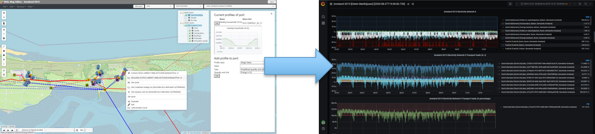

# News

ESDL MapEditor and the ESDL based Energy System Simulator (ESSIM) are available as open source under the Apache 2.0 license.

See [here](https://github.com/ESDLMapEditorESSIM/docker-toolsuite) if you'd like to know how to install this software stack on your local infrastructure

# ESDL generic information

### What is ESDL?

ESDL is a modelling language created to describe complete (hybrid) energy systems in one uniform format. It allows to describe information about the individual energy system components, how they are connected, how they are used (e.g. using energy production or consumption profiles), where they are physically located (on the map), what they cost (now and in future). Furthermore information about buildings in an area, energy potential, KPIs (on buildings, areas, or any assets) can be described. Possible applications are facilitating  interoperability between different energy transition models and publishing open data on energy systems.

### Current state

ESDL is still being developed, with new versions being released periodically. The main structure will not change anymore. New attributes can be added to ESSL classes or new classes can be added, whenever a use case requires this. We are using ESDL in many different projects now to get experience in using it and collect feedback. Some parts are still subject to discussion. Feel free to start using it!

### License

ESDL is licensed under the Apache 2.0 license, a permissive free software license written by the Apache Software Foundation. It allows users to use ESDL for any purpose, to distribute it, to modify it, and to distribute modified versions of the software under the terms of the license, without concern for royalties.

# ESDL News

### ESDL projects and applications

ESDL is used in many internal TNO projects each with a different focus. Several applications, tooling and simulation models have been developped during the last few months. More and more external projects with partners start using it. To get an impression of the possibilities have a look at [this page](esdl-based-tools/README.md) for tooling and [this page](projects/README.md) for projects

# ESDL Documentation

This documentation contains the following chapters:

* [Introduction](introduction.md): General introduction into what ESDL is and for what purposes it can be used.
* [Energy Data Modelling](energy-data-modelling.md): Explanation of the general concepts of Energy Data Modelling
* [ESDL concepts](esdl-concepts/): Explanation of the what and why of different parts of the ESDL language
* [How to use ESDL](how-to-use-esdl/README.md): Explanation of how to use ESDL, practical tips, example ESDL models
* [ESDL models and tools](esdl-based-tools/README.md): An overview of ESDL compatible models and tools
* [ESDL related projects](projects/README.md): An overview of external projects we're involved in that relate to ESDL
* [Software development with ESDL](software-development/README.md): Introduction to software programming using ESDL
* [Contributing to ESDL](esdl-contribution/setting-up-eclipse-modelling-tools/README.md): Explanation of tooling to contribute to the developments of ESDL

Alternatively, you can download an eBook version in the following formats (will not be updated regularly!):

| [PDF](https://github.com/EnergyTransition/ESDL-gitbook/raw/master/out/esdl.pdf) | [ePUB](https://github.com/EnergyTransition/ESDL-gitbook/raw/master/out/esdl.epub) | [Mobi](https://github.com/EnergyTransition/ESDL-gitbook/raw/master/out/esdl.mobi) |
| :--- | :--- | :--- |

## ESDL Model reference documentation

Additional to this website, a browsable version of the reference documentation is generated from the ESDL model. In the reference documentation all the classes, attributes and references are shown in UML-based diagrams. This site can be found at [https://energytransition.github.io/](https://energytransition.github.io/).
