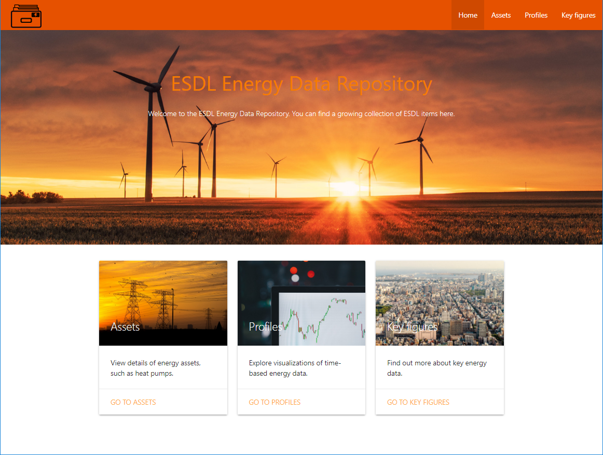
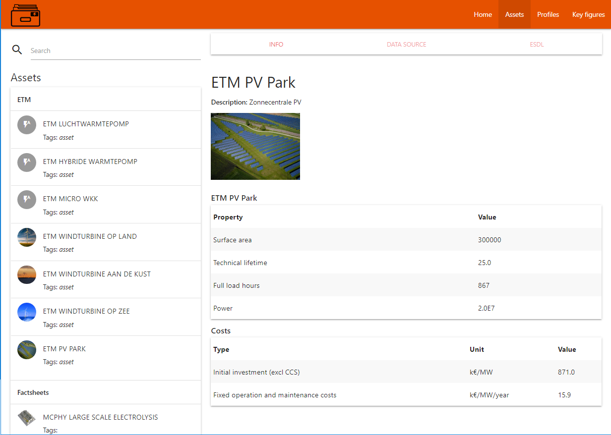
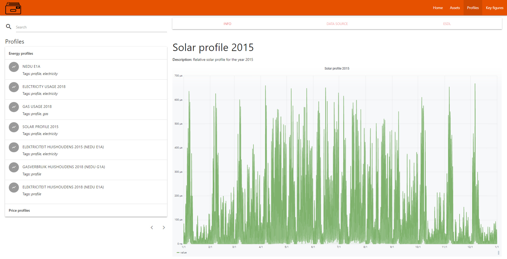
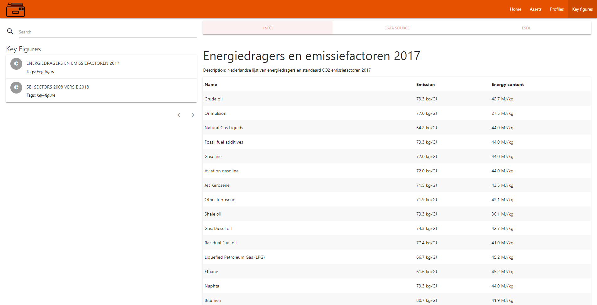

# Energy Data Repository (EDR)

The Energy Data Repository (EDR) is a first implementation of a public energy data hub, where information can be found on different aspects of the energy transition. Examples are energy demand profiles and technology factsheets. The EDR provides an API for models to access this data.

The Energy Data Repository is structured in three categories:
- Assets
- Profiles
- Key figures

## Energy Assets

ESDL allows to specify typical parameters for energy assets, like efficiencies, costs, required surface area (per installed power). The Energy Data Repository allows to publish this data, which can then be referred to from models. Currently there are two sources for the example EDR assets:
- some assets come from the Energy Transition Model ([ETM](https://energytransitionmodel.com/)) and are used in the Mondaine project
- the first initiatives to publish the Opera factsheets from TNO as ESDL models

## Profiles

The 'Profiles' section now contains some example data on energy demand, production and price profiles.

## Key figures

The 'Key figures' section currently contains two data sets, one related to the SBI sectors (Standaard Bedrijfs Indeling) from CBS (see [link](https://www.cbs.nl/nl-nl/onze-diensten/methoden/classificaties/activiteiten/sbi-2008-standaard-bedrijfsindeling-2008/de-structuur-van-de-sbi-2008-versie-2018)) and one related to energy content and CO2 emission figures for all energycarriers from RVO (see [link](https://www.rvo.nl/sites/default/files/2017/05/Nederlandse%20lijst%20van%20energiedragers%20en%20standaard%20CO2%20emissiefactoren%202017.pdf)).

