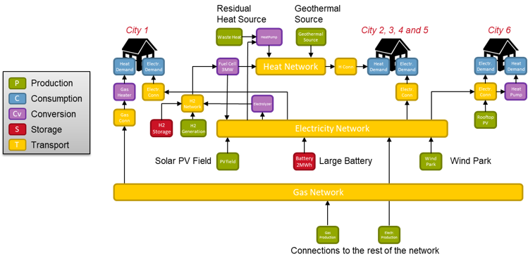
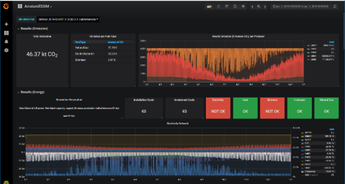

# Energy System Simulator (ESSIM)

The Energy System Simulator (ESSIM) is a tool that simulates network balancing and the effects thereof, in an interconnected hybrid energy system over a period of time. It takes as inputs the energy system defined in ESDL and calculates optimal schedule of flexible producers and the effect of this schedule in terms of emissions, costs, load on the network, etc. At the heart of the tool are:

- An algorithm to determine the order of solving the various commodity networks,
- A flexibility-based demand-supply matching algorithm that uses costs of energy production as a means to grade desirability of producers,
- A tree-based transport network solver that calculates the load on various transport elements based on the demand-supply solution determined above.

The tool outputs the data provided and generated during the course of the simulation into a database and is visualised appropriately.

## Energy system configuration

ESSIM requires an energy system description in ESDL as an input for simulation.

Together with a small amount of additional information (simulation times, description, a reference to the database to store the results) this configuration is sent to the ESSIM webservice. Once the simulation is started, first the order of simulation of the various carrier networks are determined. Then for each timestep, the energy balance for all carrier networks is determined using a price based mechanism. After about 1 minute (depending on system size and complexity) ESSIM is ready and returns a reference to a dashboard for the interpretation of the results.

Typical insights that can be obtained with ESSIM are: 

- Is my energy system well dimensioned and in balance during the whole year?
- During what periods of the year do I have excess or shortage of energy, and for what energy carrier?
- How do the different energy carriers interact with eachother?
- What is the load on the tranport infrastructure over the year and how often does overloading happen and to what extend?
- What is the total CO2 emission for the simulated system, and how is CO2 emission distributed over the different producers?
- What are the effects of adding storage?