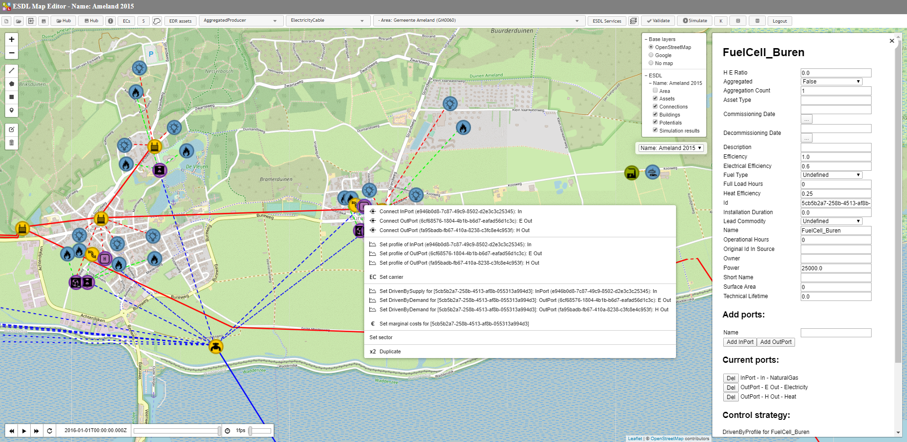
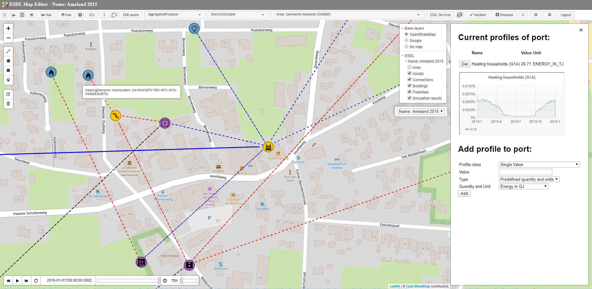
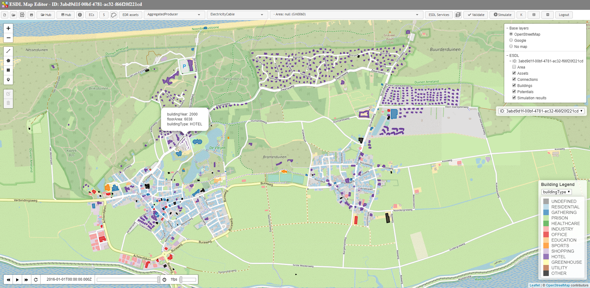
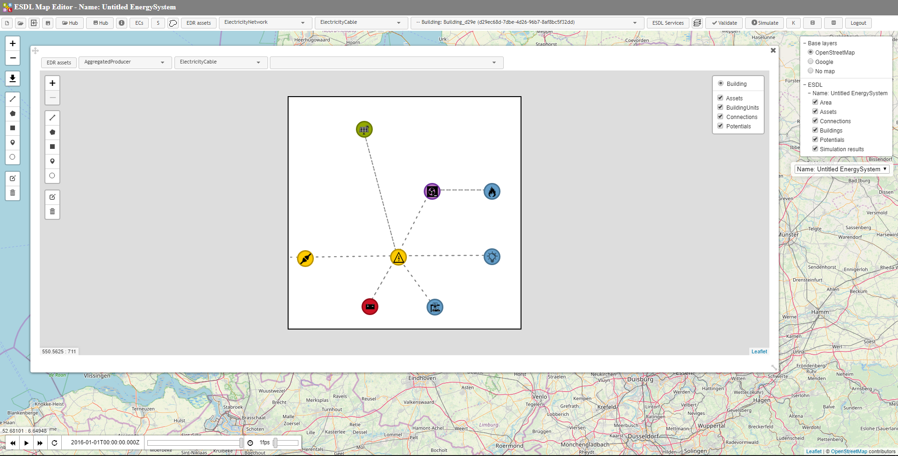

# ESDL MapEditor

The ESDL MapEditor has been developed to allow one to create an ESDL energy system description by just dragging and dropping energy system components on a map. The first application was an easy interface to our [ESSIM](essim.md) Energy System SIMulator. Over the last few months, many more applications were added to it. The ESDL MapEditor is now the entry point for many energy-related simulation engines.

We now use it as a front-end for:
- heat network simulations
- load flow simulations
- gas network simulations
- energy transition scenario simulations

Below you will find some screenshots of the ESDL MapEditor to give you an impression of its user interface and possibilities.

By clicking on an asset, the ESDL MapEditor allows you to edit the properties of any energy asset. Right click on an asset, gives you functionality like connecting assets, setting the energy carrier of the individual ports, attaching profiles to a port and setting marginal costs.

If you want to specify an hourly energy demand profile to a HeatDemand asset, the MapEditor gives an interface to do so. Most of the times we use 'relative profiles' (that add up to 1 for one year) to divide a yearly energy demand figure over time.

As ESDL allows you to describe the buildings in an area, the MapEditor is able to visualize this kind of data. You can edit building properties, like floor areas, isolation levels and type of ventilation in the building. Arbitrary KPIs can be attached to buildings. Those KPIs can then be used to color buildings based on the values of these KPIs.

The new ESDL MapEditor release has a separate building editor for in-building energy system configurations. The picture below shows an example of an all-electric house, with a heat pump, solar panels, a battery and an EV charging station. 

