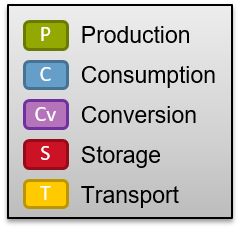

# ESDL color scheme

In our ESDL communications we always use the same colors for different asset types, as shown in the following picture.

In the table below, you can find the used color scheme for ESDL.

|            | Fill (R,G,B)   | Outline (R,G,B) |
|------------|----------------|-----------------|
| Producer   |  147, 168,   0 |   107, 122,   0 |
| Consumer   |  100, 158, 201 |    71, 115, 147 |
| Transport  |  255, 203,   0 |   188, 149,   0 |
| Storage    |  203,  19,  37 |   149,  11,  24 |
| Conversion |  181, 116, 186 |   112,  48, 160 |

