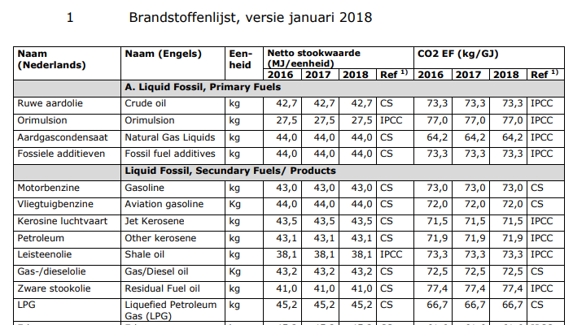

## Carriers

ESDL allows you to describe a list of carriers with parameters that are used inside your model

There are two types of carriers:
- Commodities
- Energy carriers

They serve different purposes but can be combined in the same model if required. Choices depend on the scope of the model.

The `Carriers` class is a collection of the abstract class `Carrier`. The `Carrier` class can have the following parameters:
- an `id` paramater that is used for referring to carriers.
- a `name` parameter to describe the name of the carrier.
- a `cost` paramater of type GenericProfile (allows both a fixed value as a profile that changes over time).
- a `dataSource` parameter to document the origin of the information you're using

The `Commodity` and `EnergyCarrier` classes are subclasses of `Carrier`.

# Commodity

The `Commodity` class is an abstract class, with the following subclasses:
- ElectricityCommodity: can be used for electricity. If required a distinction between different voltage levels can be made (LV, MV, HV, ...). A `voltage` parameter can be specified.
- GasCommodity: can be used for natural gas, biogas, carbon dioxide (CO2), hydrogen (H2), and so on. Distinction is done based on the `name` parameter.
- HeatCommodity: can be used for heat. If required a distinction between different temperature levels can be made (LT, MT, HT, ...). A `temperature` parameter can be specified. 
- EnergyCommodity: can be used for describing energy balances (expressed in Joules, independent of the specific commodity).

# EnergyCarrier

The `EnergyCarrier` class has the following parameters:
- an `energyContent` parameter: allows the specification of the energy content of the energy carrier
- an `energyContentUnit` parameter: the unit of the `energyContent` paramater
- an `emission` parameter: allows the specification of emission values per energy content
- an `emissionUnit` parameter: the unit of the `emission` parameter
- an `energyCarrierType` parameter: an enumeration with options `UNDEFINED`, `RENEWABLE`, `FOSSIL`
- a `stateOfMatter` parameter: an enumeration with options `UNDEFINED`, `SOLID`, `LIQUID`, `GASEOUS`

This class is based on the [list of energy carriers](https://www.rvo.nl/sites/default/files/2018/03/Nederlandse%20energiedragerlijst%202018.pdf) as published by RVO:



An example ESDL file with this information looks like:

```markup
<esdl:Carriers xmlns:esdl="http://www.tno.nl/esdl" xmlns:xsi="http://www.w3.org/2001/XMLSchema-instance">
  <carrier xsi:type="esdl:EnergyCarrier" emission="73.3" id="b2d2c781-fd13-483b-841a-72d1174aea35" name="Crude oil" energyContent="42.7">
    <emissionUnit xsi:type="esdl:QuantityAndUnitType" perUnit="JOULE" multiplier="KILO" perMultiplier="GIGA" physicalQuantity="EMISSION" unit="GRAM"/>
    <energyContentUnit xsi:type="esdl:QuantityAndUnitType" perUnit="GRAM" multiplier="MEGA" perMultiplier="KILO" physicalQuantity="ENERGY" unit="JOULE"/>
  </carrier>
  <carrier xsi:type="esdl:EnergyCarrier" emission="77.0" id="5ea788b9-adba-4ca5-b549-04c88d2a47d6" name="Orimulsion" energyContent="27.5">
    <emissionUnit xsi:type="esdl:QuantityAndUnitType" perUnit="JOULE" multiplier="KILO" perMultiplier="GIGA" physicalQuantity="EMISSION" unit="GRAM"/>
    <energyContentUnit xsi:type="esdl:QuantityAndUnitType" perUnit="GRAM" multiplier="MEGA" perMultiplier="KILO" physicalQuantity="ENERGY" unit="JOULE"/>
  </carrier>
  <carrier xsi:type="esdl:EnergyCarrier" emission="64.2" id="bfefbe09-e518-4ab5-9fb0-2d102bc58b41" name="Natural Gas Liquids" energyContent="44.0">
    <emissionUnit xsi:type="esdl:QuantityAndUnitType" perUnit="JOULE" multiplier="KILO" perMultiplier="GIGA" physicalQuantity="EMISSION" unit="GRAM"/>
    <energyContentUnit xsi:type="esdl:QuantityAndUnitType" perUnit="GRAM" multiplier="MEGA" perMultiplier="KILO" physicalQuantity="ENERGY" unit="JOULE"/>
  </carrier>
  <carrier xsi:type="esdl:EnergyCarrier" emission="73.3" id="3b667063-37c2-448a-bea2-f014d0e0a739" name="Fossil fuel additives" energyContent="44.0">
    <emissionUnit xsi:type="esdl:QuantityAndUnitType" perUnit="JOULE" multiplier="KILO" perMultiplier="GIGA" physicalQuantity="EMISSION" unit="GRAM"/>
    <energyContentUnit xsi:type="esdl:QuantityAndUnitType" perUnit="GRAM" multiplier="MEGA" perMultiplier="KILO" physicalQuantity="ENERGY" unit="JOULE"/>
  </carrier>
  <carrier xsi:type="esdl:EnergyCarrier" emission="72.0" id="c871e7db-f55c-4cee-9a22-12bebb523a54" name="Gasoline" energyContent="44.0">
    <emissionUnit xsi:type="esdl:QuantityAndUnitType" perUnit="JOULE" multiplier="KILO" perMultiplier="GIGA" physicalQuantity="EMISSION" unit="GRAM"/>
    <energyContentUnit xsi:type="esdl:QuantityAndUnitType" perUnit="GRAM" multiplier="MEGA" perMultiplier="KILO" physicalQuantity="ENERGY" unit="JOULE"/>
  </carrier>
  <carrier xsi:type="esdl:EnergyCarrier" emission="72.0" id="e59953b7-c20e-46e9-8a27-4aeb27a526d9" name="Aviation gasoline" energyContent="44.0">
    <emissionUnit xsi:type="esdl:QuantityAndUnitType" perUnit="JOULE" multiplier="KILO" perMultiplier="GIGA" physicalQuantity="EMISSION" unit="GRAM"/>
    <energyContentUnit xsi:type="esdl:QuantityAndUnitType" perUnit="GRAM" multiplier="MEGA" perMultiplier="KILO" physicalQuantity="ENERGY" unit="JOULE"/>
  </carrier>
  <carrier xsi:type="esdl:EnergyCarrier" emission="71.5" id="505db813-2d45-41eb-a6a7-de1b568a1d2a" name="Jet Kerosene" energyContent="43.5">
    <emissionUnit xsi:type="esdl:QuantityAndUnitType" perUnit="JOULE" multiplier="KILO" perMultiplier="GIGA" physicalQuantity="EMISSION" unit="GRAM"/>
    <energyContentUnit xsi:type="esdl:QuantityAndUnitType" perUnit="GRAM" multiplier="MEGA" perMultiplier="KILO" physicalQuantity="ENERGY" unit="JOULE"/>
  </carrier>
  <carrier xsi:type="esdl:EnergyCarrier" emission="71.9" id="1145da28-4f97-40ca-920d-c1eaa17821c8" name="Other kerosene" energyContent="43.1">
    <emissionUnit xsi:type="esdl:QuantityAndUnitType" perUnit="JOULE" multiplier="KILO" perMultiplier="GIGA" physicalQuantity="EMISSION" unit="GRAM"/>
    <energyContentUnit xsi:type="esdl:QuantityAndUnitType" perUnit="GRAM" multiplier="MEGA" perMultiplier="KILO" physicalQuantity="ENERGY" unit="JOULE"/>
  </carrier>
  <carrier xsi:type="esdl:EnergyCarrier" emission="73.3" id="88436afe-3cf5-46d9-b154-0760aa7e7178" name="Shale oil" energyContent="38.1">
    <emissionUnit xsi:type="esdl:QuantityAndUnitType" perUnit="JOULE" multiplier="KILO" perMultiplier="GIGA" physicalQuantity="EMISSION" unit="GRAM"/>
    <energyContentUnit xsi:type="esdl:QuantityAndUnitType" perUnit="GRAM" multiplier="MEGA" perMultiplier="KILO" physicalQuantity="ENERGY" unit="JOULE"/>
  </carrier>
  <carrier xsi:type="esdl:EnergyCarrier" emission="74.3" id="6290780a-f184-4f62-9208-68c5e2280a32" name="Gas/Diesel oil" energyContent="42.7">
    <emissionUnit xsi:type="esdl:QuantityAndUnitType" perUnit="JOULE" multiplier="KILO" perMultiplier="GIGA" physicalQuantity="EMISSION" unit="GRAM"/>
    <energyContentUnit xsi:type="esdl:QuantityAndUnitType" perUnit="GRAM" multiplier="MEGA" perMultiplier="KILO" physicalQuantity="ENERGY" unit="JOULE"/>
  </carrier>
  <carrier xsi:type="esdl:EnergyCarrier" emission="77.4" id="597aacef-5697-44e4-b64d-395a394b3553" name="Residual Fuel oil" energyContent="41.0">
    <emissionUnit xsi:type="esdl:QuantityAndUnitType" perUnit="JOULE" multiplier="KILO" perMultiplier="GIGA" physicalQuantity="EMISSION" unit="GRAM"/>
    <energyContentUnit xsi:type="esdl:QuantityAndUnitType" perUnit="GRAM" multiplier="MEGA" perMultiplier="KILO" physicalQuantity="ENERGY" unit="JOULE"/>
  </carrier>
  <carrier xsi:type="esdl:EnergyCarrier" emission="66.7" id="3203b562-2e44-4b69-ac98-27ca0a1ed868" name="Liquefied Petroleum Gas (LPG)" energyContent="45.2">
    <emissionUnit xsi:type="esdl:QuantityAndUnitType" perUnit="JOULE" multiplier="KILO" perMultiplier="GIGA" physicalQuantity="EMISSION" unit="GRAM"/>
    <energyContentUnit xsi:type="esdl:QuantityAndUnitType" perUnit="GRAM" multiplier="MEGA" perMultiplier="KILO" physicalQuantity="ENERGY" unit="JOULE"/>
  </carrier>
  <dataSource xsi:type="esdl:DataSource" description="Nederlandse lijst van energiedragers en standaard CO2 emissiefactoren" attribution="http://www.rvo.nl" version="Januari 2017" reference="109749/BL2017" releaseDate="2017-01-01 00:00:00" id="bb60eb43-f5c1-4e77-87ec-e618a6be181f"/>
</esdl:Carriers>
```


