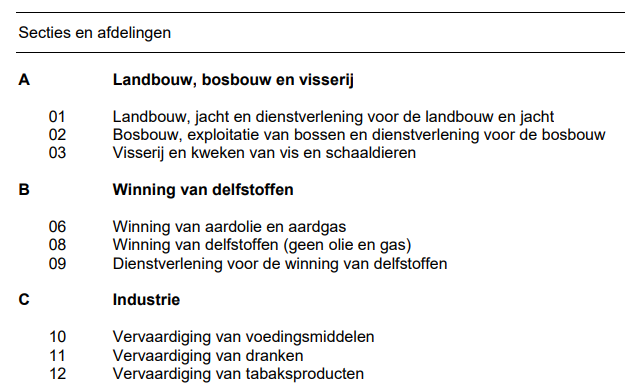

## Sectors

ESDL allows you to describe a list of sectors that can be used inside your model. In the model you can make a reference to a specific sector in the list from every asset, service, or party. Tools can then calculate total energy consumption per sector, or total investment costs per sector.

The `Sectors` class is a collection of the class `Sector`. The `Sector` class can have the following parameters:
- an `id` paramater that is used for referring to sectors.
- a `name` parameter to describe the name of the sector.
- a `description` parameter to give a description of the sector.
- a `code` parameter to describe the code of the sector.
- a `dataSource` parameter to document the origin of the information you're using

This class is based on the [standaard bedrijfsindeling](https://www.cbs.nl/-/media/_pdf/2018/17/sbi-2008-versie-2018.pdf) as published by CBS:



An example ESDL file with this information looks like:

```markup
<esdl:Sectors xmlns:esdl="http://www.tno.nl/esdl" xmlns:xsi="http://www.w3.org/2001/XMLSchema-instance">
  <sector xsi:type="esdl:Sector" code="A" name="Landbouw, bosbouw en visserij" id="8982b717-86a5-45ce-a402-c1efab2c40d6"/>
  <sector xsi:type="esdl:Sector" code="01" name="Landbouw, jacht en dienstverlening voor de landbouw en jacht" id="9cfbb97e-d047-42f3-8243-5b90270613b4"/>
  <sector xsi:type="esdl:Sector" code="02" name="Bosbouw, exploitatie van bossen en dienstverlening voor de bosbouw" id="b1c006e3-e1fa-4d07-9047-a3650b9ed4fd"/>
  <sector xsi:type="esdl:Sector" code="03" name="Visserij en kweken van vis en schaaldieren" id="56b907d8-c8c9-4182-b740-799ed2816b74"/>
  <sector xsi:type="esdl:Sector" code="B" name="Winning van delfstoffen" id="0864919d-4702-46ef-8983-5997246f8892"/>
  <sector xsi:type="esdl:Sector" code="06" name="Winning van aardolie en aardgas" id="96d05789-1633-4eec-8638-c7ac33ec0251"/>
  <sector xsi:type="esdl:Sector" code="08" name="Winning van delfstoffen (geen olie en gas)" id="af9f4c3d-f536-4cf7-9169-fdd62e4b5fd7"/>
  <sector xsi:type="esdl:Sector" code="09" name="Dienstverlening voor de winning van delfstoffen" id="807ff737-f2ab-420c-9df2-05d3851ef661"/>
  <sector xsi:type="esdl:Sector" code="C" name="Industrie" id="9fd2adc8-3694-446d-b54c-1a902030422e"/>
  <sector xsi:type="esdl:Sector" code="10" name="Vervaardiging van voedingsmiddelen" id="3357c253-e53e-4f57-a15f-8386dffb3adb"/>
  <sector xsi:type="esdl:Sector" code="11" name="Vervaardiging van dranken" id="674dc4db-06e1-4b10-a284-b556234f1a52"/>
  <sector xsi:type="esdl:Sector" code="12" name="Vervaardiging van tabaksproducten" id="8f10ecfb-1552-4596-a4f2-b9c80846cddd"/>
  <dataSource xsi:type="esdl:DataSource"
    version="Versie 2018"
	reference="https://www.cbs.nl/nl-nl/onze-diensten/methoden/classificaties/activiteiten/sbi-2008-standaard-bedrijfsindeling-2008/de-structuur-van-de-sbi-2008-versie-2018"
	releaseDate="2018-01-01 00:00:00"
	id="8f6fac80-7aae-42a6-9f08-dd0b84abf082"
	description="De structuur van de SBI 2008 - versie 2018"/>
</esdl:Sectors>
```