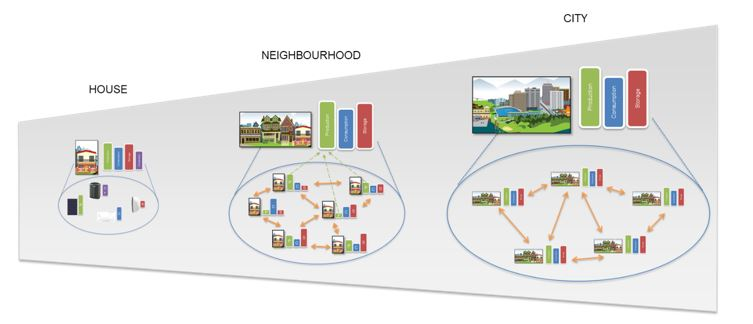

# Design principles

## Energy Capabilities

There are vast amount of different assets in an energy system all having their specific characteristics \(e.g cables, heat networks, power plants, solar PV and many more\). Modelling an energy system in much detail therefore requires lots of work describing all different assets. However, if we look into the different assets and compare theirs behaviour we see that primarily all assets provide one \(or more\) core functionality and can all be categorized in one of the following five capabilities.

Some examples:

* Production: SolarPV panel, Wind Turbine, etc.
* Consumption: Households electricity consumption, heat consumption of a city, etc.
* Storage: Home battery, heat buffer, etc.
* Transport: District heating, electricity grid, etc.
* Conversion: Heat Pump, Transformer, Gas burner, etc.

Describing the assets in terms of capabilities achieves two things that are very welcome. Firstly we can make an abstraction of an assets by only modelling characteristics that are relevant per capability. This results in an simplification for the user of ESDL since he now can approach different asset types in a similar way. For instance a PV panel \(Production\) can be approached in a similar way as a wind turbine \(Production\) with slightly different characteristics. This makes life easier for those who want to reason on energy systems \(evolution\) with calculation tools.

Secondly, every capability comes with a natural way of aggregation. For instance, if the consumption capability for every house in a street is defined \(for instance as electric power consumption/year\), then the aggregated consumption capability of the whole street can be determined by calculating the sum of all the consumption capabilities. This is achieved by modelling all energy consumers as consumer capability. The following section describes the use of this aggregation in ESDL.

## Levels of aggregation

Modelling an energy system can be done in multiple different levels of detail \(geographical scales\). The level of detail needed depends on the application. For making a energy plan on country level it is much likely not necessary to model the energy consumption of every single building in that country separately with a high time resolution. However, for designing a district heating installation in a specific area it might be possible that that detailed information is necessary. ESDL does not prescribe a certain detail level of modelling of an energy system, it supports describing energy systems on multiple levels. Depending on the application, or the availability of data, a modeler can choose an appropriate modelling level

ESDL supports the modelling of energy systems on detail levels such as: house, building, neighbourhood, city etc . Because in ESDL everything is modelled in terms of capabilities \(previous section\) the different levels are also modelled in terms of capabilities. This means that for instance a house can have a certain level of production, consumption and storage, the ESDL model on neighbourhood scale can be expressed in the same capabilities by taking the aggregated values of the capabilities of all houses in that neighbourhood. The same can be done for city and country scales. This results in a generic way of modelling energy systems independent of the scale \(detail level\). This simplifies reasoning on different energy systems for applications.

## Example of modelling with energy capabilities

An model of a possible hybrid energy system, with carriers electricity, natural gas, hydrogen and heat, that can be described with ESDL, is depicted in Figure 1.

