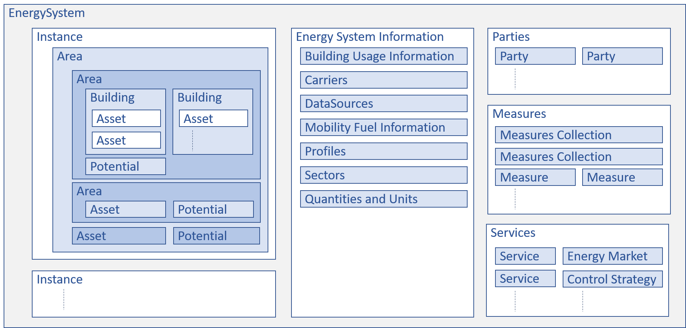
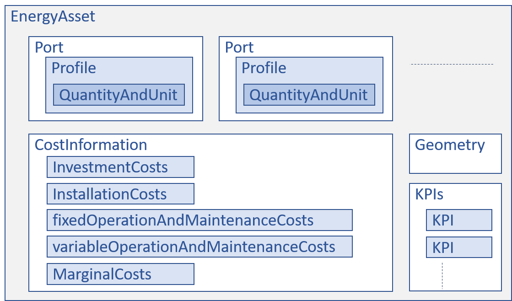

# EnergySystem structure

The high level structure of an EnergySystem description is shown below:

An EnergySystem description can contain the following elements:
- [Instances](data-types/energy-system.md#instances): One or more instances of the same EnergySystem, e.g. to model evolvement over time
- [EnergySystemInformation](data-types/energysysteminformation/README.md): Generic information that can be used in all instances. Typically listed once here, and used multiple times by referring to the information here.
- [Parties](data-types/energy-system.md#parties): Parties involved in the EnergySystem, e.g. to model ownership of assets or areas.
- [Measures](data-types/energy-system.md#measures): Individual measures or collections of measures, including cost information, that can be applied in the EnergySystem by tools or models.
- [Services](data-types/items-assets-and-energyassets/README.md#services): (Experimental) Abstract information like services (demand response, aggregator services), energy markets and control strategies.

One of the most important items, is the EnergyAsset. It has the following high level structure:

