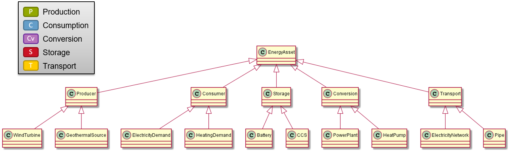

# EnergySystem structure

The high level structure of an EnergySystem description is shown in the following picture. Scroll down to see some examples to show the most fequent used classes and their relations.

An EnergySystem description can contain the following elements:
- [Instances](data-types/energy-system.md#instances): One or more instances of the same EnergySystem, e.g. to model evolvement over time
- [EnergySystemInformation](data-types/energysysteminformation/README.md): Generic information that can be used in all instances. Typically listed here once, and used multiple times by referring to the information here.
- [Parties](data-types/energy-system.md#parties): Parties involved in the EnergySystem, e.g. to model ownership of assets or areas.
- [Measures](data-types/energy-system.md#measures): Individual measures or collections of measures, including cost information, that can be applied in the EnergySystem by tools or models.
- [Services](data-types/items-assets-and-energyassets/README.md#services): (Experimental) Abstract information like services (demand response, aggregator services), energy markets and control strategies.

One of the most important items, is the EnergyAsset. It has the following high level structure:

To show the typical structure of an energy system description in ESDL, see the following five pictures.

The EnergySystem class is the class to start with if you'd like to model an energy system. An EnergySystem may contain 0, 1 or more instances. Important other information that can be added to an EnergySystem is EnergySystemInformation, Services, Measures and Parties. 

An instance can be labelled with a specific date or period. Furthermore an Instance may contain 0 or 1 Areas. This is the Area to denote the scope of the system you'd like to model. This can be your country if you would like to describe your national energy balance. However it can have any scope, but it's the biggest Area in your EnergySystem. Areas can be subdivided into smaller Areas.

Each Area can contain Assets and Potentials. KPIs that where calculated by some model can be attached to every Area.

An Asset is a physical thing, possibly with a Geometry and CostInformation. Its Geometry specifies its location and shape on the map. CostInformation contains information about for example installation costs, investment costs, operation and maintenance costs, and so on.

Specific types of Assets are Buildings and EnergyAssets. Buildings may contain Assets again (to model an in-house energy system).

EnergyAssets exist in 5 different types, the so called ESDL capabilities: Producer, Consumer, Storage, Conversion and Transport. These 5 types of Assets have many subtypes. Of each capability two example sub classes have been shown.

EnergyAssets may have Ports. Ports can be used to connect EnergyAssets. Other information related to a Port are Carriers and Profiles.

EnergySystemInformation contains generic information that can be used in all instances: information is typically listed here once, to be used multiple times by referring to the information here.

Exaple information is:
- QuantityAndUnits: List of quantities and units in the energy system (e.g. energy in GJ, installation costs in EUR/MW, ...)
- MobilityFuelInformation: Allows to model information about typical fuel efficiencies per vehicle type
- BuildingUsageInformation: Allows to model how a building is used, opening hours, setpoints for heating and cooling
- Datasources: Allow you to administer where the information you're using comes from
- Profiles: Standard profiles that can be used multiple times in the energy system, e.g. typical heat demand profile for households
- Carriers: List of energy carriers and commodities (electricity, natural gas, hydrogen, heat, bio gas, ...)
- Sectors: Allows labelling assets with a sector, e.g. industry, households, companies, mobility, ...

