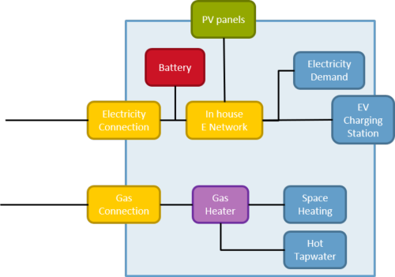
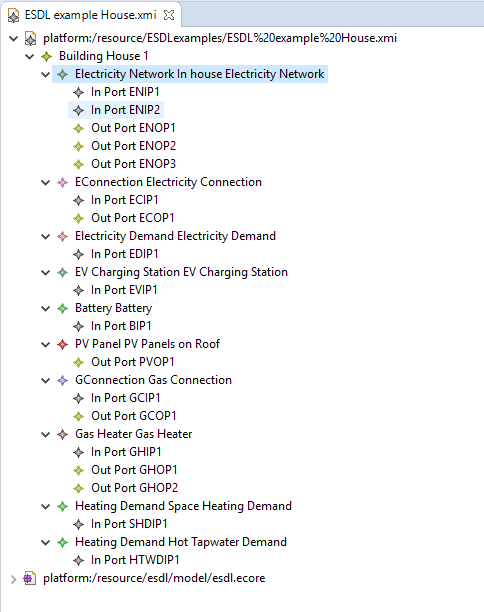
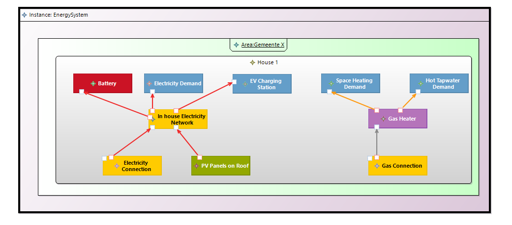

# Describing a house

An example house as shown in the picture below can easily be described in ESDL.



In the eclipse tree editor the house would look like this:



In the eclipse graphical desginer the house \(with an EnergySystem, Instance and Area around it\) would look like this:



The ESDL would look like this:



```markup
<?xml version="1.0" encoding="UTF-8"?>
<esdl:Building
    xmi:version="2.0"
    xmlns:xmi="http://www.omg.org/XMI"
    xmlns:xsi="http://www.w3.org/2001/XMLSchema-instance"
    xmlns:esdl="http://www.tno.nl/esdl/1807a"
    xsi:schemaLocation="http://www.tno.nl/esdl/1807a ../esdl/model/esdl.ecore"
    id="H1"
    name="House 1"
    commissioningDate="2010-07-15T01:00:00.000+0200"
    energyLabel="LABEL_D"
    slantedRoofArea="60.0">
  <asset xsi:type="esdl:ElectricityNetwork"
      id="EN1"
      name="In house Electricity Network"
      voltage="230.0">
    <port xsi:type="esdl:InPort"
        id="ENIP1"
        connectedTo="ECOP1"/>
    <port xsi:type="esdl:InPort"
        id="ENIP2"
        connectedTo="PVOP1"/>
    <port xsi:type="esdl:OutPort"
        id="ENOP1"
        connectedTo="BIP1"/>
    <port xsi:type="esdl:OutPort"
        id="ENOP2"
        connectedTo="EVIP1"/>
    <port xsi:type="esdl:OutPort"
        id="ENOP3"
        connectedTo="EDIP1"/>
  </asset>
  <asset xsi:type="esdl:EConnection"
      id="EC1"
      name="Electricity Connection">
    <port xsi:type="esdl:InPort"
        id="ECIP1"/>
    <port xsi:type="esdl:OutPort"
        id="ECOP1"
        connectedTo="ENIP1"/>
  </asset>
  <asset xsi:type="esdl:ElectricityDemand"
      id="ED1"
      name="Electricity Demand">
    <port xsi:type="esdl:InPort"
        id="EDIP1"
        connectedTo="ENOP3"/>
  </asset>
  <asset xsi:type="esdl:EVChargingStation"
      id="EV1"
      name="EV Charging Station">
    <port xsi:type="esdl:InPort"
        id="EVIP1"
        connectedTo="ENOP2"/>
  </asset>
  <asset xsi:type="esdl:Battery"
      id="B1"
      name="Battery">
    <port xsi:type="esdl:InPort"
        id="BIP1"
        connectedTo="ENOP1"/>
  </asset>
  <asset xsi:type="esdl:PVPanel"
      id="PV1"
      name="PV Panels on Roof"
      surfaceArea="16"
      power="3000.0">
    <port xsi:type="esdl:OutPort"
        id="PVOP1"
        connectedTo="ENIP2"/>
  </asset>
  <asset xsi:type="esdl:GConnection"
      id="GC1"
      name="Gas Connection">
    <port xsi:type="esdl:InPort"
        commodity="GAS"
        id="GCIP1"/>
    <port xsi:type="esdl:OutPort"
        commodity="GAS"
        id="GCOP1"
        connectedTo="GHIP1"/>
  </asset>
  <asset xsi:type="esdl:GasHeater"
      id="GH1"
      name="Gas Heater"
      efficiency="90.0">
    <port xsi:type="esdl:InPort"
        commodity="GAS"
        id="GHIP1"
        connectedTo="GCOP1"/>
    <port xsi:type="esdl:OutPort"
        commodity="HEAT"
        id="GHOP1"
        connectedTo="SHDIP1"/>
    <port xsi:type="esdl:OutPort"
        commodity="HEAT"
        id="GHOP2"
        connectedTo="HTWDIP1"/>
  </asset>
  <asset xsi:type="esdl:HeatingDemand"
      id="SHD1"
      name="Space Heating Demand">
    <port xsi:type="esdl:InPort"
        commodity="HEAT"
        id="SHDIP1"
        connectedTo="GHOP1"/>
  </asset>
  <asset xsi:type="esdl:HeatingDemand"
      id="HTW1"
      name="Hot Tapwater Demand">
    <port xsi:type="esdl:InPort"
        commodity="HEAT"
        id="HTWDIP1"
        connectedTo="GHOP2"/>
  </asset>
</esdl:Building>
```



