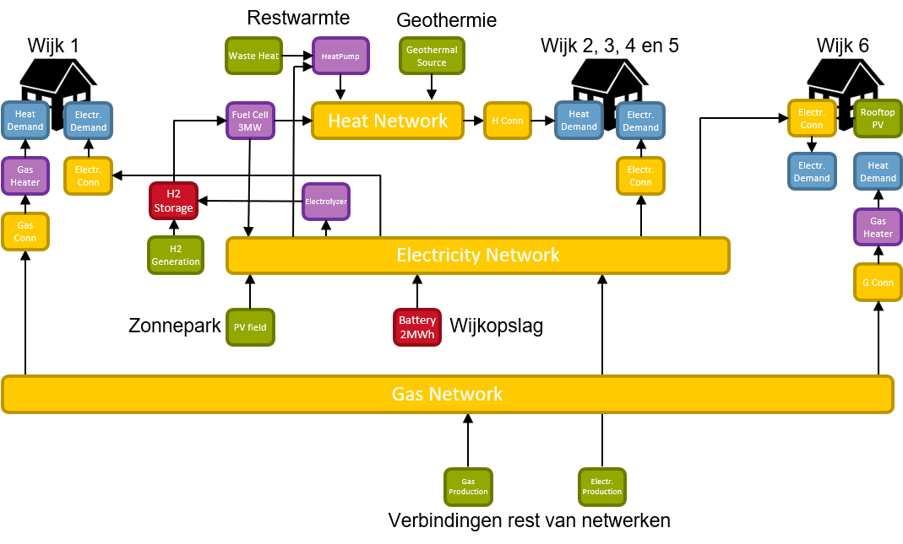

# Describing a municipality

An example municipality as shown in the picture below can easily be described in ESDL.

A similar municipality example is published on GitHub at the following URL:

{% embed data="{\"url\":\"https://github.com/EnergyTransition/ESDL-municipality-example\",\"type\":\"link\",\"title\":\"EnergyTransition/ESDL-municipality-example\",\"description\":\"Example ESDL description of a municipality. Contribute to EnergyTransition/ESDL-municipality-example development by creating an account on GitHub.\",\"icon\":{\"type\":\"icon\",\"url\":\"https://github.com/fluidicon.png\",\"aspectRatio\":0},\"thumbnail\":{\"type\":\"thumbnail\",\"url\":\"https://avatars0.githubusercontent.com/u/40061405?s=400&v=4\",\"width\":420,\"height\":420,\"aspectRatio\":1}}" %}

