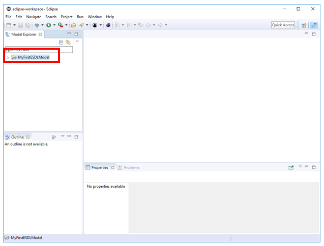
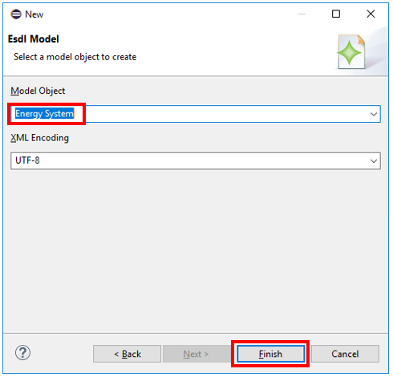

# ESDL Tree editor

## Introduction

This document describes defining your first ESDL model using the ESDL tree editor. The Tree editor shows ESDL-files as an hierarchical tree and is directly generated from the ecore-model that defines ESDL. Therefore all concepts defined in ESDL are automatically available in the Tree editor.

## Defining your first ESDL model

* [Step 1: Start Eclipse and select workspace](esdl-tree-editor.md#step-1-start-eclipse-and-select-workspace)
* [Step 2: Create new project](esdl-tree-editor.md#step-2-create-new-project)
* [Step 3: Create new ESDL model](esdl-tree-editor.md#step-3-create-new-esdl-model-within-the-project)
* [Step 4: Edit ESDL model](esdl-tree-editor.md#step-4-edit-esdl-model)

### Step 1: Start Eclipse and select workspace

Start eclipse by executing eclipse.exe from the folder your installed eclipse in Select a directory to store all your eclipse projects and press the “Launch” button:

Press the “X” in the welcome window:

### Step 2: Create new project

Select “File” --&gt; “New” --&gt; “Project…” Select “Project” from the “General” folder and click “Next”

Give your project a name and click “Finish”:

### Step 3: Create new ESDL model within the project

Right click on your project and select “New” --&gt; “Other…”

Enter “esdl” in the filter textbox and select “ESDL Model” from the available wizards:

Give your ESDL model a name:

Select “Energy System” as a model object to create and click “Finish”:

This opens the ESDL Tree editor for your newly generated ESDL model. The top part of the screen shows the newly created model in the Tree editor. In the bottom of the screen it shows the Properties of the currently selected ESDL-concept and allows you to manipulate these properties.:

### Step 4: Edit ESDL model

Right click on the Energy System and select “New Child” --&gt; “Instance” and give the instance a name in the properties panel:

Add an area to the instance and give the area a name:

Add more areas or energy assets according to your needs… Start playing around!

