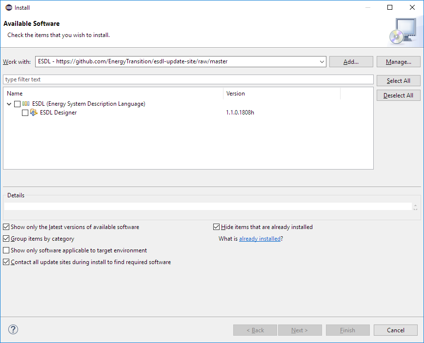

# Setup Eclipse using the update site

## Installing Eclipse ESDL editor

### Step 0: Download Oracle JDK \(if necessary\)

Go to [www.oracle.com/technetwork/java/javase/downloads/index.html](http://www.oracle.com/technetwork/java/javase/downloads/index.html) and press the “Download” button under the “JDK” text to download the JDK. Version 1.8 or higher should be fine.

### Step 1: Download Eclipse Modelling Tools

From: [http://www.eclipse.org/downloads/packages/](http://www.eclipse.org/downloads/packages/)

Go to the section "Eclipse Modelling Tools" and select for example “Windows 64-bit”: [http://www.eclipse.org/downloads/download.php?file=/technology/epp/downloads/release/photon/R/eclipse-modeling-photon-R-win32-x86\_64.zip](http://www.eclipse.org/downloads/download.php?file=/technology/epp/downloads/release/photon/R/eclipse-modeling-photon-R-win32-x86_64.zip)

## Add ESDL plugin update site

To install all the required components and edit ESDL-files, an Eclipse update-site is available to get the latest version of the ESDL Designer and the ESDL model.

To do that, you need to add an eclipse update site to your eclipse installation.

### Step 1: Open eclipse and close "Welcome Screen"

### Step 2: Select "Help" --&gt; "Install new software..."

### Step 3: Press "Add..." to add a new software repository

Give the Repository a name and use the following URL as location:

\`\`[`https://github.com/EnergyTransition/esdl-update-site/raw/master`](https://github.com/EnergyTransition/esdl-update-site/raw/master)

You can also drag and drop the above URL on the "Install new software" dialog \(depicted above\) or the "Add new repository" dialog.

### Step 4: Select the package "ESDL \(Energy System Description Language\)"

Follow the required steps to let Eclipse add the required ESDL components.

Eclipse in now configured to use ESDL and you will receive notifications whenever there are updates.

