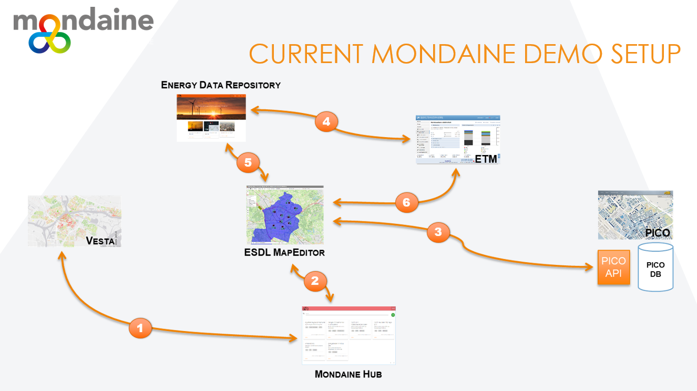

# Mondaine 

The mondaine acronym stands for "MOdels aNd DAta INterfaces for Energy". This project is subsidised by the Dutch National Government. 

Modaine partners are:
- Balance
- EKwadraat
- Geodan
- Object Vision
- Quintel
- TNO

More information:
- [Link](https://www.mondaine-suite.nl/) to the Mondaine website.
- [Link](https://projecten.topsectorenergie.nl/projecten/models-and-data-interface-for-energy-20-00031738) to the Mondaine project website of TKI Urban Energy

## Mondaine demo at the November 2019 symposium

The following youtube video shows the status of the model integration during the symposium in November 2019.

What you will see is a step-by-step process as visualised in the below picture.

1. The outcomes of a VESTA model run for the 'start analyse' have been uploaded to the Mondaine Hub
2. The user selects one of the strategies from the Mondaine Hub and loads the results into the ESDL MapEditor. Calculated VESTA KPIs for neighbourhoods are shown on the map.
3. The user queries the PICO model for information about the available space for wind turbines. Information is visualised on the map. 
4. The ETM model for a wind turbine including its typical characteristics has been uploaded into the ESDL Energy Data Repository
5. The user selects a 'Wind turbine on land' from the ESDL Energy Data Repository and using the earlier requested information about wind potential adds several turbines on the map. Next to this a solar PV field is added as an example in an open field.
6. The combined information is communicated to the Energy Transition Model. The user checks the information coming from VESTA (about heating solutions for the built environment) and the manually added wind turbines and solar PV fields. Other information (e.g. about mobility) can now be changed inside the ETM to assess other scenarios.

