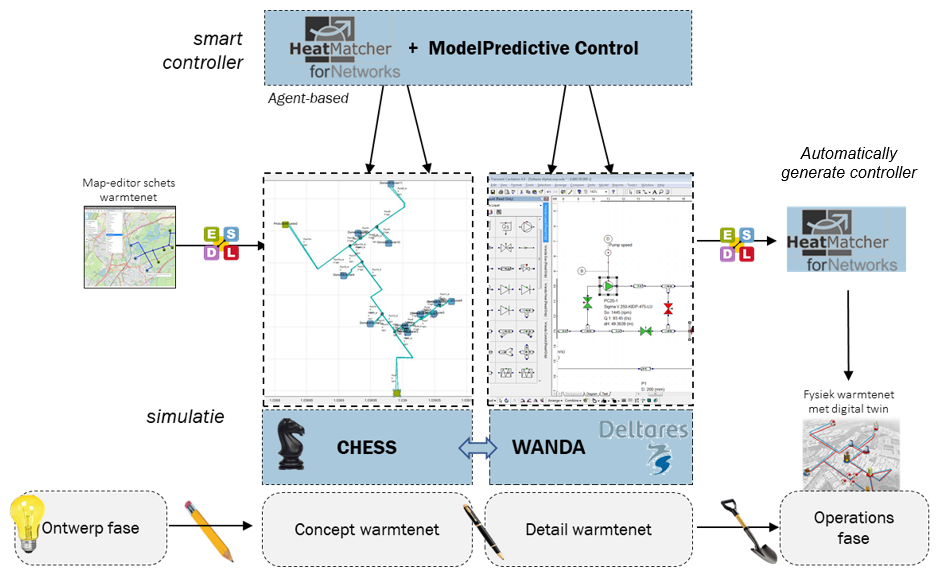

# Warming Up

Warming Up is a program funded by the Dutch national government that is aiming to improve the methodology and tooling for the design and control of future 4th generation district heating and cooling networks.

Click (here)[https://www.tno.nl/nl/over-tno/nieuws/2019/12/partijen-in-warmteketen-werken-samen-voor-betaalbare-duurzame-warmte/] and (here)[https://www.topsectorenergie.nl/urban-energy/innovatieprogramma/mmips-voor-de-gebouwde-omgeving/mmip4] for more information

The following pictures shows the first ideas for a high-level functional diagram of the foreseen Warming Up toolchain. Other tools and models might be added in future.

