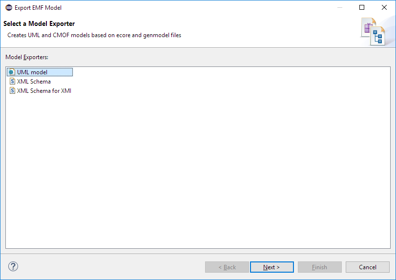
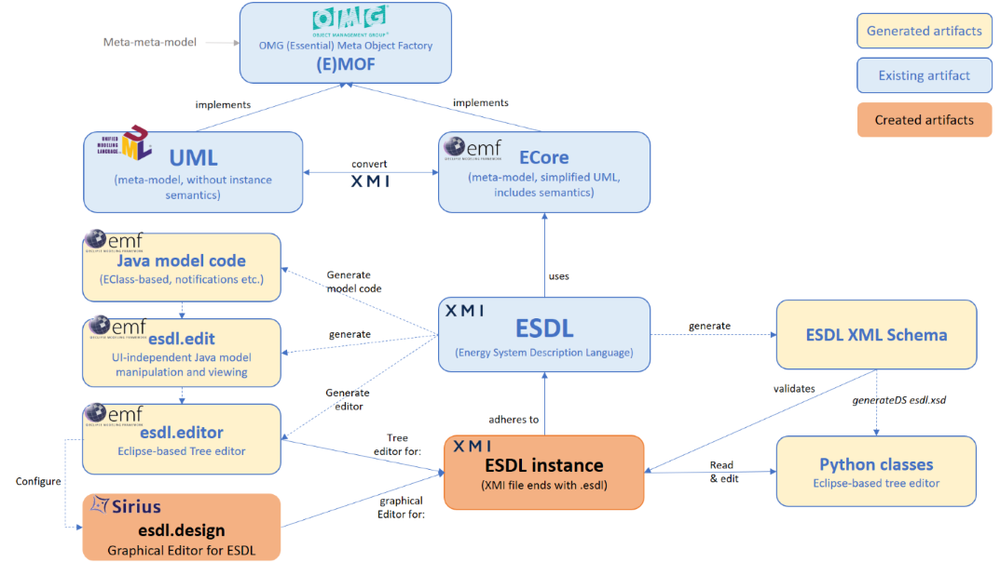

# Developing software that uses ESDL

## Java
ESDL is made to be used in all kinds of applications. Since the ESDL-model is EMF-based, the simplest way is to use the generated model code directly using Java or another JVM-based language.

## Python
If you're used to programming in Python, the [PyEcore](https://pyecore.readthedocs.io/en/latest/index.html) project provides very nice support for handling ecore models in Python.

Click [here](integration-with-python-and-pyecore.md) to see detailed instructions

## Others (javascript, typescript, ...)
An alternative is using the generated XML-Schema to integrate with non-Java-based programming languages. When code is generated, it automatically creates this XML-schema called `esdlXML.xsd`. Other export options are also available, as EMF stores its models in XMI \(XML Metadata Interchange\):

* XML Schema for XMI \(creating an XMI-based XML schema\)
* UML - uses the UML concepts to export to the UML. UML files can subsequently read by other UML modeling tools such as Enterprise Architect or Papyrus UML editor.

You can find these export options by right-clicking on the `esdl.genmodel` file and select "Export model..."

Summarizing the following toolchain is currently available for ESDL \(and in use\):

