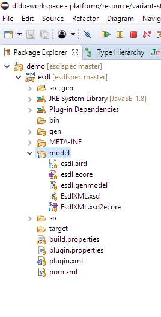

# Setting up the Eclipse Modelling Tools

## Download Eclipse Modelling tools

Currently Oxygen 3a is the latest stable release of Eclipse. The complete package can be downloaded [here](https://www.eclipse.org/downloads/packages/eclipse-modelling-tools/oxygen3a). Choose **Eclipse Modelling Tools** from the list. Or you can download the Eclipse installer from the [general download page](https://www.eclipse.org/downloads/) and select the Eclipse Modelling Tools from the list of options after running the executable.

## Setting up Eclipse Modelling Tools

After downloading and installing Eclipse and Eclipse Modelling Tools, you start Eclipse Modelling Oxygen by double clicking on the created icon on the Desktop \(if you are using Windows...\). It will ask you where you want to place your workspace files. Select a logical location and you end up with a welcome screen.

If you did not clone the repository yet, now is a good moment with your preferred GIT tool or use Eclipse to import the repository directly.

Next step is importing the ESDL git repository by using File -&gt; Import... If you already cloned the repository locally, use _Existing Project into Workspace_ and the project will be imported. If you want to directly import the project from Git, use Git-&gt;Projects from Git.

After importing, the _Package explorer_ will show the following files and directories:

In the model folder you see several files:

* `esdl.aird` - In this file the graphical representation of the ESDL concepts are documented, such as the \(x,y\) location of the classes, the colour of the classes, the font, etc. It allows us to visually modify the contents of the ESDL model. If you double click you can open the ESDL model diagram editor and manipulate the model.
* `esdl.ecore` - This is ESDL. The UML-based model describing all ESDL concepts: the vocabulary and grammar of an Energy System. If you double click you can edit the ESDL model using a tree-based structure \(less convenient than the diagram editor\)
* `esdl.genmodel` - This file describes how to generate Java-files and XSD Schemas from an `ecore`-file. It contains a dozen configuration options.
* `esdlXML.xsd` - this is the XML Schema file for ESDL
* `esdlXML.xsd2ecore` - maps the XSD to the `Ecore` model.

Double clicking on the aird-file opens the following dialog:

The AIRD file shows the model dependencies and representation. The Design-&gt;Entities in a Class Diagram is the most interesting. Double click on `esdl` to open this representation.

There is also a Review representation that shows all the documentation in the model. \(although this is work in progress\).

Now you're setup to edit the Energy System Description Language!

