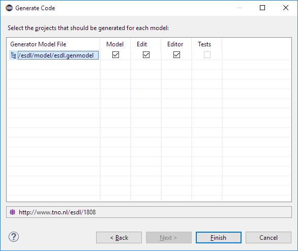

# Generating model, edit and editor code

Since Ecore-based models such as the ESDL model contain semantics, source code can be generated from this model. EMF allows you to create three different types of source code:

* ESDL Model code - creates Java-classes out of the model, including the ECore semantics \(they inherit from the`EObject-`class\)
* ESDL Edit code - creates editor-independent code to manipulate and edit the ESDL model instances.
* ESDL Editor code - creates the Tree-based editor described [here](../../using-esdl-to-model-an-energy-system/esdl-tree-editor.md) to edit ESDL model instances.

## Using the `.genmodel`

Code generation is specified in the `esdl.genmodel` file. In Eclipse you can open this file in its own editor. In the properties there are a lot of options you can configure to change the code generation behaviour. 

When right-clicking on the esdl-package you can select Generate... to generate one or more of the above mentioned artefacts, or press Ctrl+Shift+G to pop-up the Generator dialog.

The current `esdl.genmodel` is configured to produce an XML Schema too, that can be used by other non-Java-based software. The next chapters shows how to integrate with e.g. Python.

