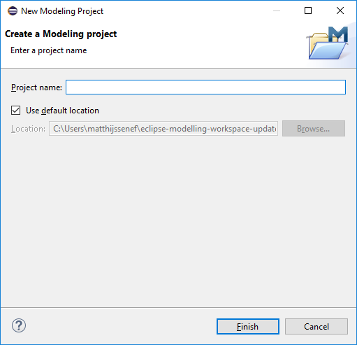
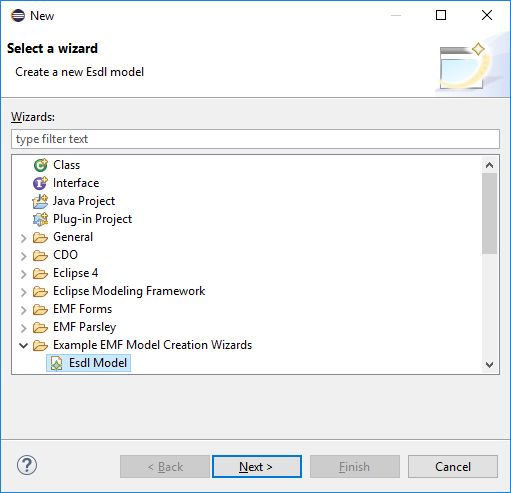
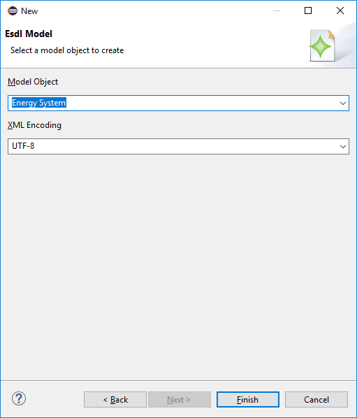
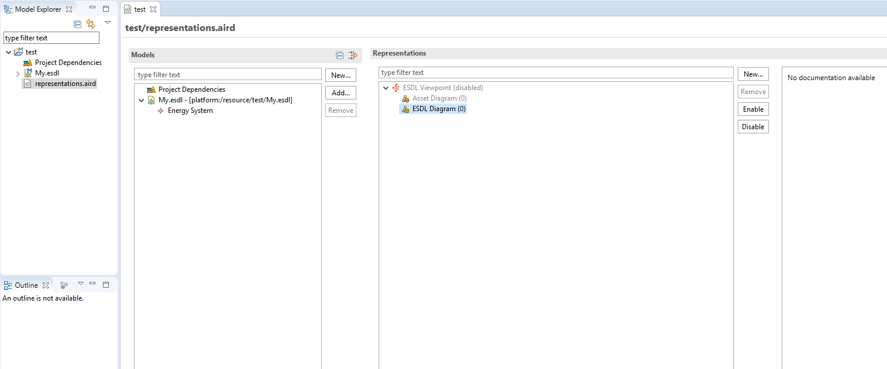
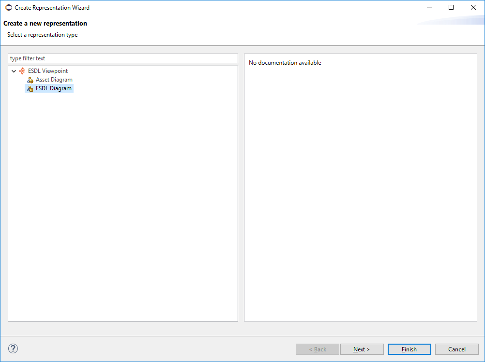
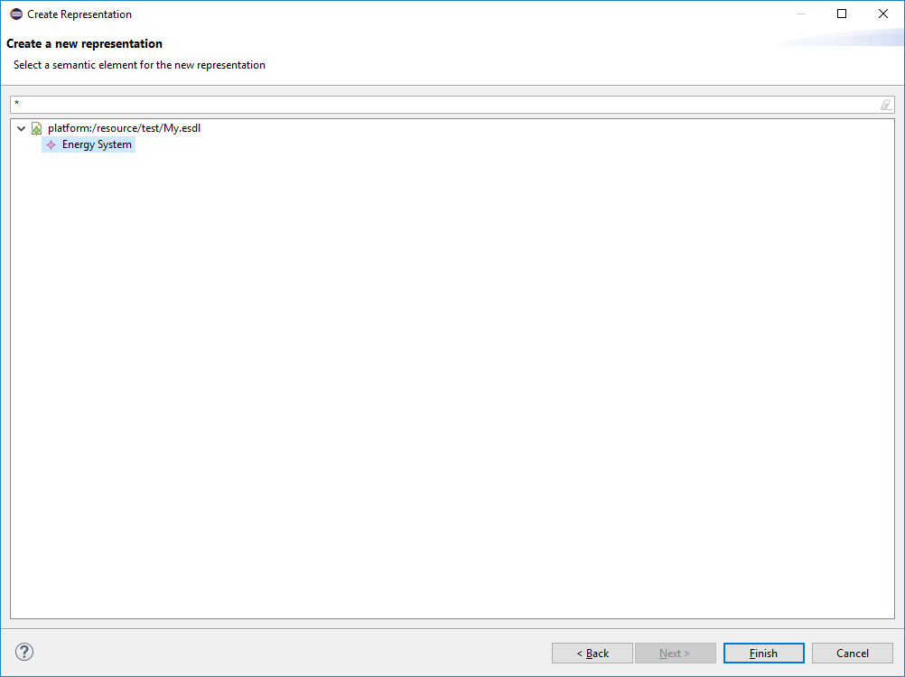
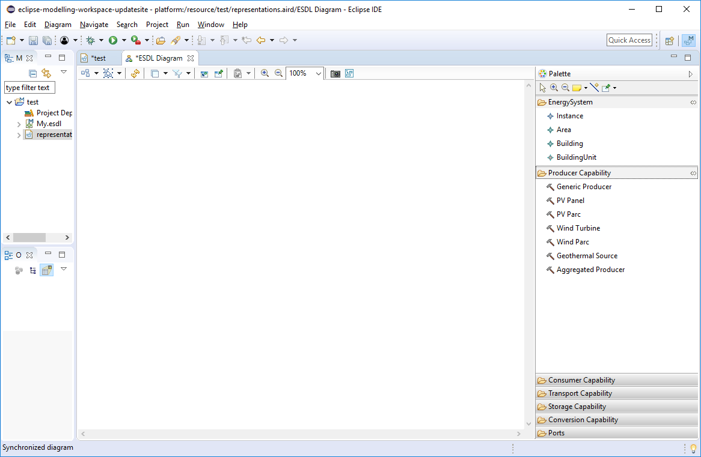
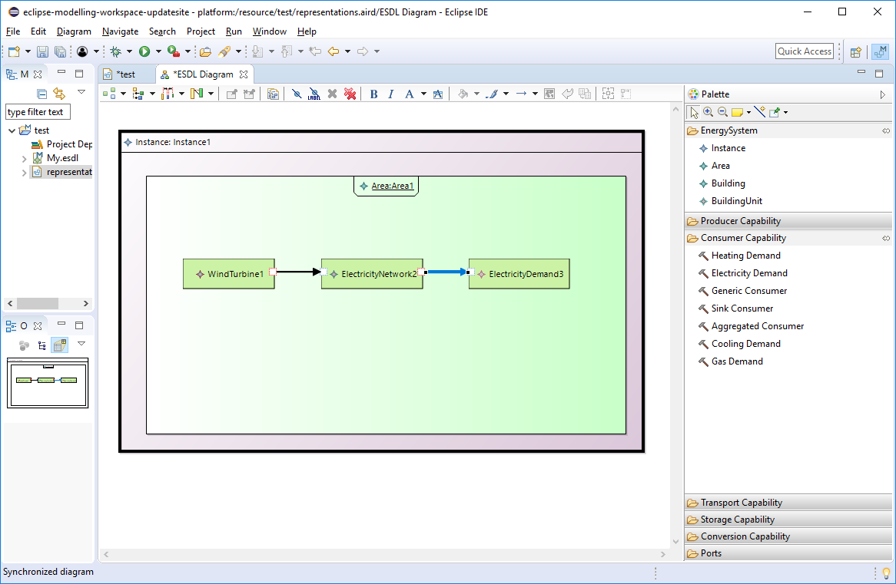

# ESDL graphical editor

After installing the ESDL eclipse plugins using the eclipse update site, you can start designing a new Energy System using this tutorial

### Step 1. Create a new Modeling Project

Select File --> New --> Modeling Project

### Step 2. Create a new ESDL model 

Select File --> New --> Other and select 'ESDL model' in the dialog box that appears. Presse 'Next'

### Step 3. Select 'Energy System'

Select 'Energy System' from the dropdown list under 'Model Object' and click 'Finish'

### Step 4. Create a new model representation

Double click the representations.aird file in the project, and click 'New' under the 'Representations' section 

### Step 5. Select 'ESDL Diagram' and click 'Next'

### Step 6. Select the 'Energy System' from your ESDL model and click 'Finish'

### Step 7. You now see the canvas in front of you 

### Step 8. Add an Instance, an Area, some Assets and connect them

