# ESDL tree editor

## Introduction

This document describes the following topics:

* [Installing Eclipse ESDL editor](esdl-tree-editor.md#installing-eclipse-esdl-editor)
* [Defining your first ESDL model](esdl-tree-editor.md#defining-your-first-esdl-model)

## Installing Eclipse ESDL editor

### Step 0: Download Oracle JDK \(if necessary\)

Go to [www.oracle.com/technetwork/java/javase/downloads/index.html](http://www.oracle.com/technetwork/java/javase/downloads/index.html) and press the “Download” button under the “JDK” text to download the JDK.

### Step 1: Download Eclipse Modeling Tools

From: [http://www.eclipse.org/downloads/packages/](http://www.eclipse.org/downloads/packages/)

Select for example “Windows 64-bit”: [http://www.eclipse.org/downloads/download.php?file=/technology/epp/downloads/release/oxygen/2/eclipse-modeling-oxygen-2-win32-x86\_64.zip](http://www.eclipse.org/downloads/download.php?file=/technology/epp/downloads/release/oxygen/2/eclipse-modeling-oxygen-2-win32-x86_64.zip)

### Step 2: Unzip zip-file on local hard drive

Unzip for example to C:\Apps\eclipse-modeling-tools

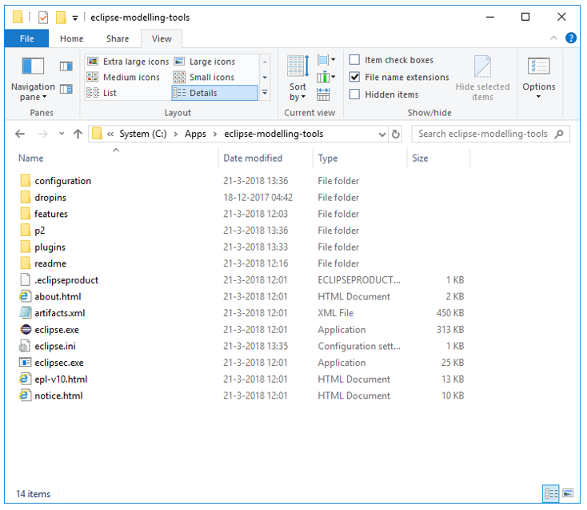

### Step 3: Add ESDL plugin files to plugins directory

A zip file with the ESDL plugins can be found [here](https://github.com/EnergyTransition/ESDL-tooling/blob/master/ESDL_plugins_for_eclipse_v1806.zip).

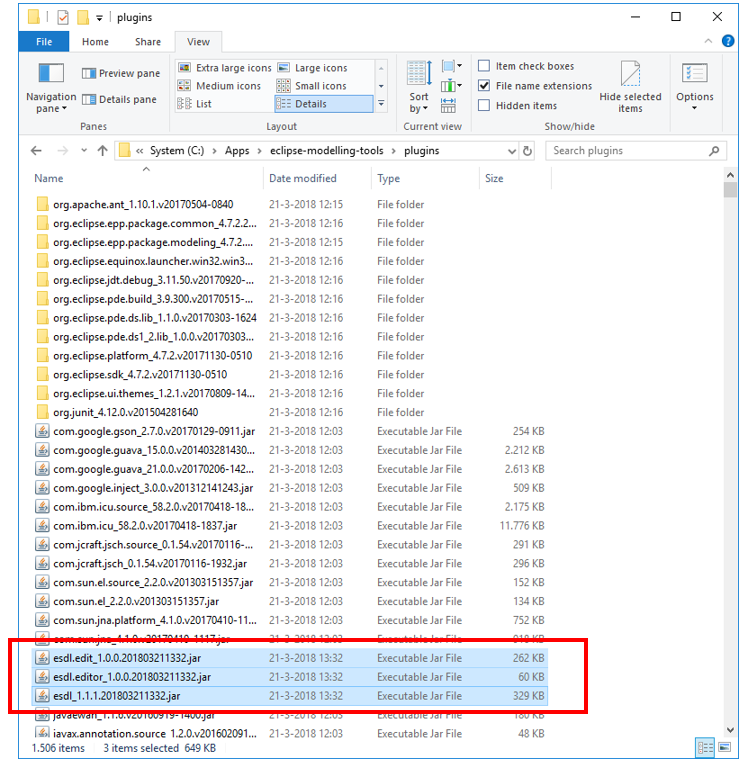

## Defining your first ESDL model

* [Step 1: Start Eclipse and select workspace](esdl-tree-editor.md#step-1-start-eclipse-and-select-workspace)
* [Step 2: Create new project](esdl-tree-editor.md#step-2-create-new-project)
* [Step 3: Create new ESDL model](esdl-tree-editor.md#step-3-create-new-esdl-model-within-the-project)
* [Step 4: Edit ESDL model](esdl-tree-editor.md#step-4-edit-esdl-model)

### Step 1: Start Eclipse and select workspace

Start eclipse by executing eclipse.exe from the folder your installed eclipse in  
Select a directory to store all your eclipse projects and press the “Launch” button:

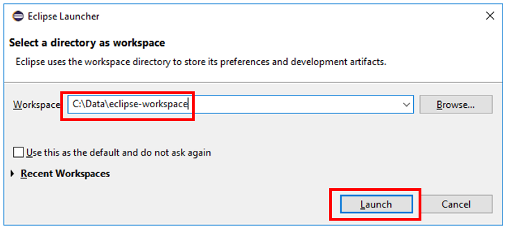

Press the “X” in the welcome window:

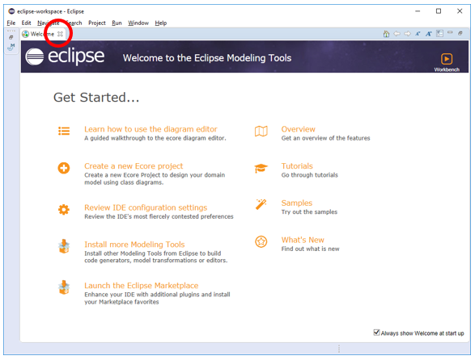

### Step 2: Create new project

Select “File” --&gt; “New” --&gt; “Project…” Select “Project” from the “General” folder and click “Next”

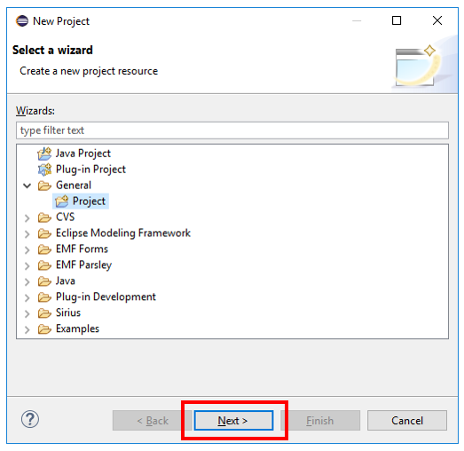

Give your project a name and click “Finish”:

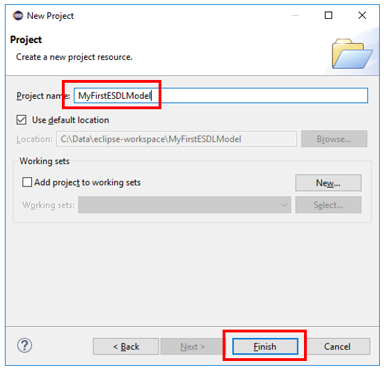

### Step 3: Create new ESDL model within the project

Right click on your project and select “New” --&gt; “Other…”

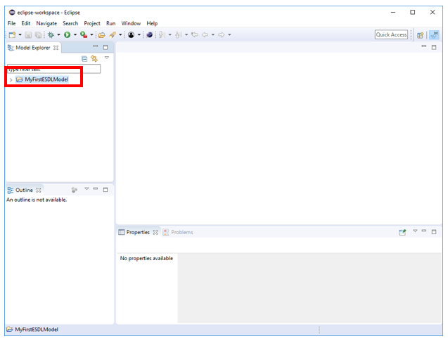

Enter “esdl” in the filter textbox and select “ESDL Model” from the available wizards:

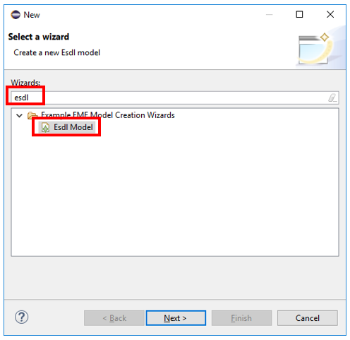

Give your ESDL model a name:

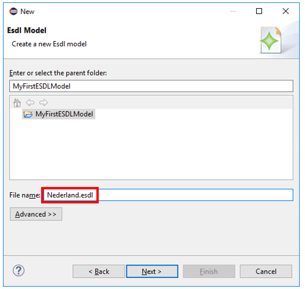

Select “Energy System” as a model object to create and click “Finish”:

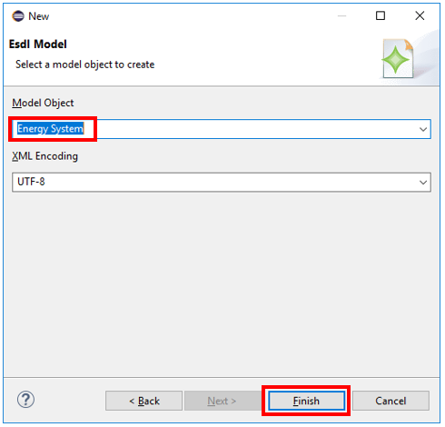

This opens de ESDL editor for your newly generated ESDL model:

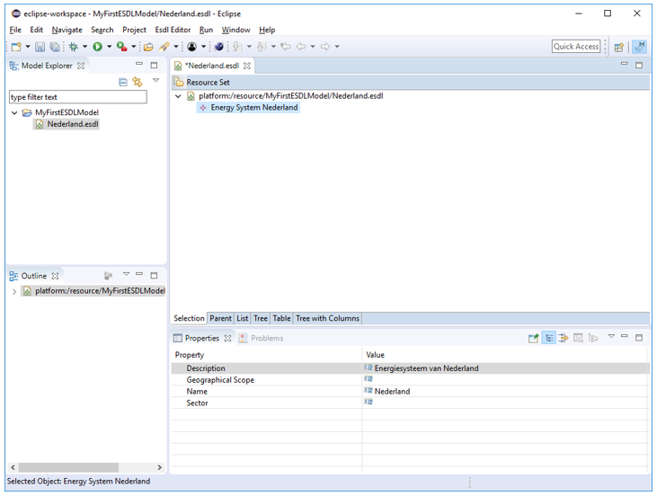

### Step 4: Edit ESDL model

Right click on the Energy System and select “New Child” --&gt; “Instance” and give the instance a name in the properties panel:

Add an area to the instance and give the area a name:

Add more areas or energy assets according to your needs… Start playing around!

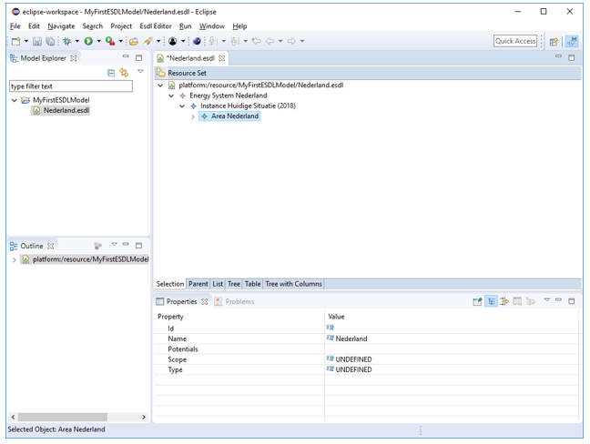

